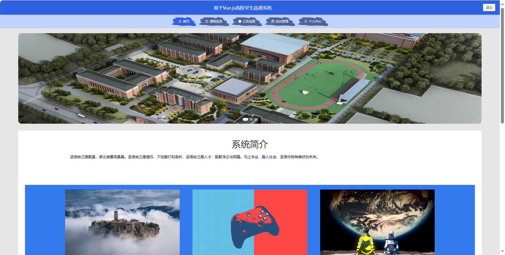
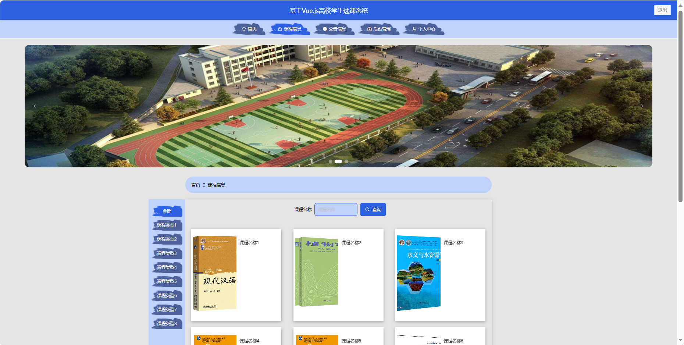
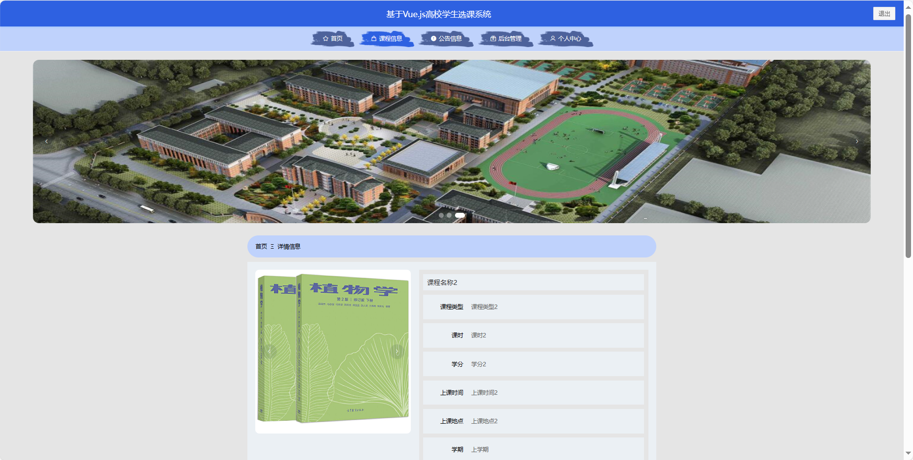
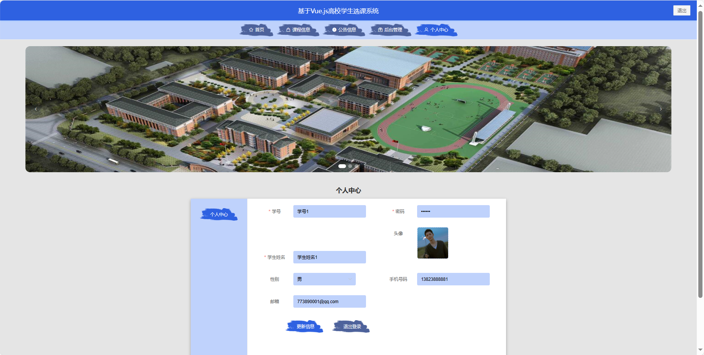
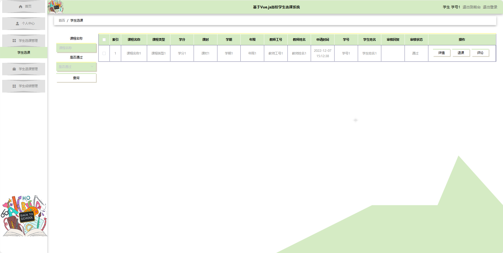
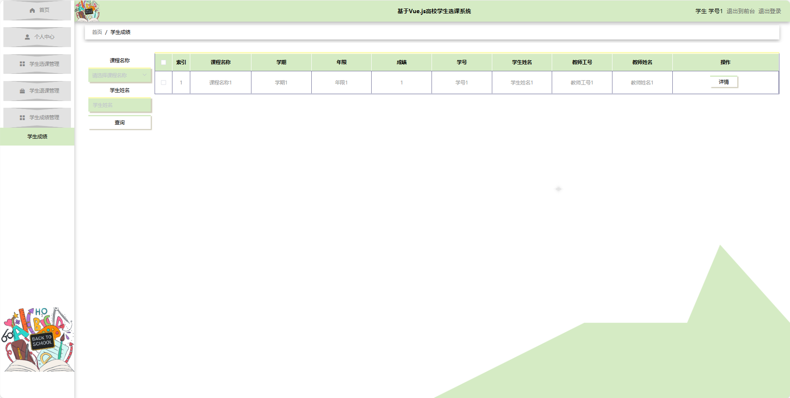
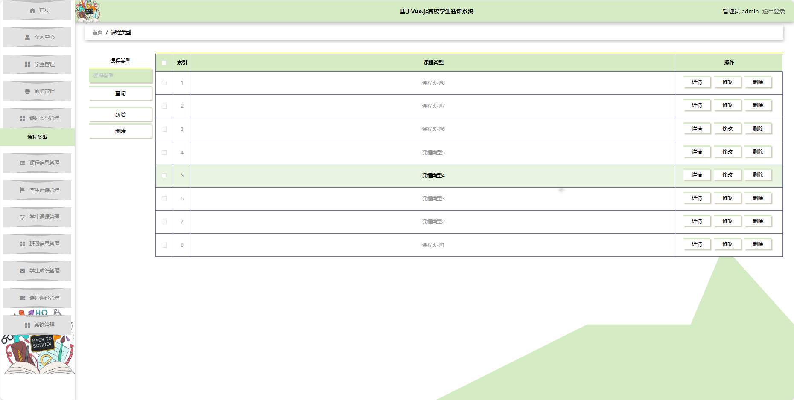

## 基于SpringBoot的高校学生选课系统

###  获取sql数据库文件: 从戎源码网 (https://armycodes.com/) QQ: 386869957 QQ群: 377586148
###  所有系统地址: (https://github.com/YuLin-Coder/AllProjectCatalog) 
###  所有项目以及源代码本人均调试运行无问题 可支持远程安装部署调试、定制修改、代码讲解

## 项目介绍
基于SpringBoot的高校学生选课系统，系统包含三种角色：管理员、用户、教师，主要功能如下。

### 【管理员】:
1. 首页：查看系统整体信息。
2. 个人中心：管理管理员的个人信息。
3. 学生管理：查看、编辑和删除学生信息。
4. 教师管理：查看、编辑和删除教师信息。
5. 课程类型管理：管理不同类型课程的分类信息。
6. 课程信息管理：添加、编辑和删除课程信息。
7. 学生选课管理：查看学生的选课情况，并进行管理。
8. 学生退课管理：处理学生的退课请求。
9. 班级信息管理：管理系统中的班级信息。
10. 学生成绩管理：录入和管理学生成绩。
11. 课程评论管理：查看和管理用户对课程的评论。
12. 系统管理：管理系统的基础设置和配置。

### 【教师功能】
1. 首页：查看系统。
2. 个人中心：管理教师的个人信息。
3. 课程信息管理：查看、编辑和删除自己负责的课程信息。
4. 学生选课管理：查看学生选课情况，并进行管理。
5. 学生退课管理：处理学生的退课请求。
6. 班级信息管理：管理教师负责的班级信息。
7. 学生成绩管理：录入和管理自己教授的学生成绩。
8. 课程评论管理：查看和管理用户对自己课程的评论。

### 【用户】:
1. 首页：浏览系统最新的课程和公告信息。
2. 课程信息：查看各类课程的详细信息。
3. 公告信息：获取系统发布的重要公告和通知。
4. 后台管理：系统提供的管理界面。
5. 个人中心：管理个人信息、查看已选课程、评价课程等。

## 项目技术
- 编程语言：Java
- 数据库：MySQL
- 项目管理工具：Maven
- 前端技术：HTML、CSS、JavaScript、Jquery、Vue
- 后端技术：Spring、SpringMVC、MyBatis

## 运行环境
- JDK版本：JDK1.8及以上
- 开发工具：IDEA、Ecplise、Myecplise都可以
- 数据库: MySQL5.7及以上
- Maven：maven3.0及以上
- Node：14.14.0及以上

## 运行截图

